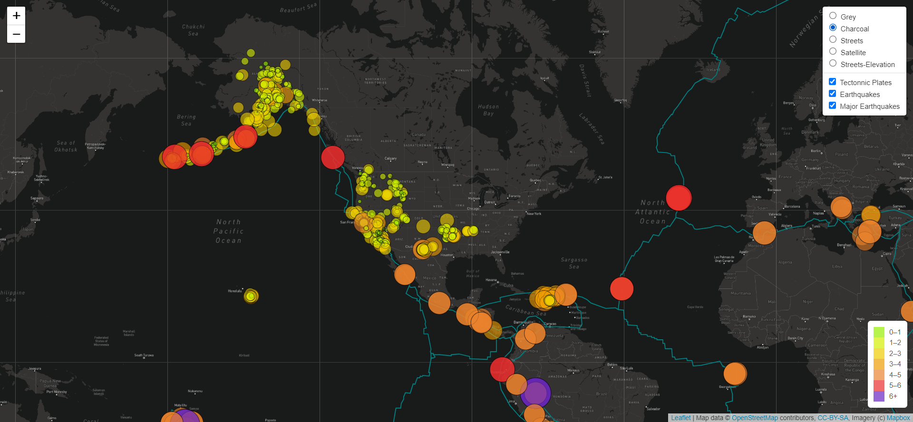

# Mapping_Earthquakes
Using GeoJSON to map earthquakes

## Purpose

The purpose of this project is to visually show the differences between the magnitudes of earthquakes all over the world for the last seven days. The final deliverable can be found in the main folder. 

- [Final js code](https://github.com/AfroQ/Mapping_Earthquakes/blob/main/static/js/challenge_logic.js)
- [HTML code](https://github.com/AfroQ/Mapping_Earthquakes/blob/main/index.html)

## Tasks

To complete this project, use a URL for GeoJSON earthquake data from the USGS website and retrieve geographical coordinates and the magnitudes of earthquakes for the last seven days. Then add the data to a map.

## Approach

I use JavaScript and the D3.js library to retrieve the coordinates and magnitudes of the earthquakes from the GeoJSON data. I also use the Leaflet library to plot the data on a Mapbox map through an API request and create interactivity for the earthquake data.

**See map screenshot below:** 

